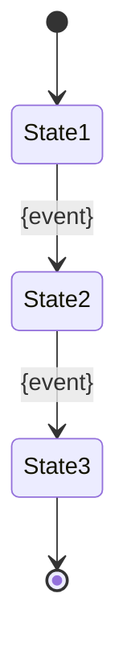

# {TableName}

> **First documented**: YYYY-MM-DD
> **Last updated**: YYYY-MM-DD
> **Last verified by**: @username
> **Verification status**: ⚠️ Needs verification | ✅ Verified

---
> **NOTE**: This template serves as the standard for documenting database tables. Copy this content to `{table-name}.md` in `tables/` directory and fill in all placeholders.

---

## Overview

{What this table represents, why it exists, business purpose}

**Business Context**: {Domain concept this table models}

**Key Use Cases**:
- {Use case 1 - e.g., "Track staff shift assignments"}
- {Use case 2 - e.g., "Calculate overtime hours"}
- {Use case 3}

**Lifecycle**: {Brief: Created → Updated → Deleted/Archived}

## Schema Reference

```sql
-- PostgreSQL schema reference
CREATE TABLE {schema_name}.{table_name} (
  id UUID PRIMARY KEY DEFAULT gen_random_uuid(),
  tenant_id UUID NOT NULL REFERENCES platform.accounts(id),

  -- Business columns
  {column_name} {type} {constraints},

  -- Audit
  created_at TIMESTAMPTZ NOT NULL DEFAULT now(),
  updated_at TIMESTAMPTZ NOT NULL DEFAULT now(),
  deleted_at TIMESTAMPTZ,

  -- Constraints
  CONSTRAINT fk_{name} FOREIGN KEY ({column}) REFERENCES {table}({id}) ON DELETE CASCADE
);

-- Indexes
CREATE INDEX idx_{name} ON {table_name}({columns});
CREATE UNIQUE INDEX idx_{name} ON {table_name}({columns});

-- Prisma model reference
// File: packages/database/prisma/schema.prisma
// Model: {ModelName}
```

**Click-to-navigate**: Ctrl+click (Cmd+click on Mac) the Prisma schema path above to jump to the model definition.

## Columns

| Column | Type | Nullable | Default | Purpose | Notes |
|--------|------|----------|---------|---------|-------|
| `id` | UUID | No | gen_random_uuid() | Primary key | Auto-generated, indexed |
| `tenantId` | UUID | No | - | Tenant FK | Required for multi-tenancy, indexed |
| `{field}` | {type} | {yes/no} | {default} | {purpose} | {notes, validation rules} |
| `createdAt` | Timestamptz | No | now() | Creation timestamp | Auto-managed |
| `updatedAt` | Timestamptz | No | now() | Last update | Auto-managed |
| `deletedAt` | Timestamptz | Yes | NULL | Soft delete | Filter: `WHERE deleted_at IS NULL` |

### Column Details

#### {column_name}

- **Type**: {PostgreSQL type}
- **Nullable**: {Yes/No}
- **Default**: {Default value or expression}
- **Purpose**: {What this column stores}
- **Validation**: {Constraints, check constraints, business rules}
- **Business rules**: {Application-level validation}
- **Gotchas**: {Common issues or edge cases}

## Relations

### One-to-Many

- **Has many** [`{ChildTable}`](../tables/{child-table}.md) via `{fk_column}`
  - **Cascade**: {What happens when parent is deleted}
  - **Business rule**: {Any special rules}

- **Belongs to** [`{ParentTable}`](../tables/{parent-table}.md) via `{parent_id}`
  - **Required**: {Yes/No}
  - **Validation**: {Any FK constraints}

### Many-to-Many

- **Many-to-many** with [`{OtherTable}`](../tables/{other-table}.md) through [`{JunctionTable}`](../tables/{junction-table}.md)
  - **Junction columns**: `{this_table_id}`, `{other_table_id}`
  - **Additional attributes**: {Fields on junction table}
  - **Business rules**: {Constraints on the relationship}

### Cross-Schema

- **References** `tenant_xxx.[`{table}`](../tables/{table}.md)` via `{column}`
  - **Composite FK**: `(tenant_id, {column})`
  - **Migration**: {timestamp}_{name}

### Click-to-Navigate

All table references above are clickable links. Ctrl+click (Cmd+click on Mac) to jump to related table documentation.

## Business Rules

{Invariant rules enforced by application logic}

### {Rule Category}

- **Rule**: {Description}
- **Enforcement**: {Application layer | Database constraint}
- **Violation**: {What happens if rule is broken}

### Data Integrity

- **Uniqueness**: {What must be unique}
- **Required fields**: {What cannot be null}
- **Referential integrity**: {FK rules}

### State Machine



**Valid transitions**: {List allowed state changes}

## Type Fixing

{Issues found from type checking, fixes applied}

### Type Mismatches Found

```markdown
- [ ] Fixed: `{column}` type mismatch
  - **Before**: {Prisma type} ≠ {DB type}
  - **After**: {Correct type}
  - **Migration**: {timestamp}_{name}
  - **Verified**: ✅
```

### Nullability Issues

```markdown
- [ ] Fixed: `{column}` nullability
  - **Before**: Optional in Prisma, NOT NULL in DB
  - **After**: Consistent - {choice}
  - **Impact**: {What broke, what was fixed}
  - **Migration**: {timestamp}_{name}
```

### TODOs: Type Issues

```markdown
- [ ] [P0] Fix {column} type mismatch - {Prisma type} vs {DB type} - breaks: {what}
- [ ] [P1] Make {column} consistent - current: {inconsistency} - migration: {timestamp}_{name}
```

## Queries

{Common query patterns, performance notes}

### Fetch All Active Records

```sql
-- Prisma
await prisma.{model}.findMany({
  where: {
    tenantId,
    deletedAt: null
  },
  orderBy: { createdAt: 'desc' }
});

-- SQL
SELECT *
FROM {schema_name}.{table_name}
WHERE tenant_id = $1 AND deleted_at IS NULL
ORDER BY created_at DESC;
```

**Index used**: `idx_{table}_tenant_deleted`

### Filter by Status

```sql
-- Prisma
await prisma.{model}.findMany({
  where: {
    tenantId,
    status: {value}
  },
  take: 100
});

-- SQL
SELECT *
FROM {schema_name}.{table_name}
WHERE tenant_id = $1 AND status = $2
LIMIT 100;
```

**Index used**: `idx_{table}_tenant_status`

### Join with Related Table

```sql
-- Prisma
await prisma.{model}.findMany({
  where: { tenantId },
  include: {
    {relation}: true
  }
});

-- SQL
SELECT t.*, r.*
FROM {schema_name}.{table_name} t
JOIN {schema_name}.{related_table} r ON r.{id} = t.{fk_column}
WHERE t.tenant_id = $1 AND t.deleted_at IS NULL;
```

**Performance**: {Notes on join performance, index usage}

### Gotchas

- {Common mistake - e.g., "Forgetting tenant_id filter causes cross-tenant leakage"}
- {Performance issue - e.g., "N+1 query when using includes"}
- {Data integrity concern - e.g., "Soft deletes require manual cascade"}

## TODOs

{Outstanding work for this table}

### High Priority

```markdown
- [ ] [P0] Fix {critical issue} - {impact} - assigned: @username - due: YYYY-MM-DD
- [ ] [P1] Add {missing index} - query: {slow query} - planned: YYYY-MM-DD
```

### Medium Priority

```markdown
- [ ] [P2] Document {undocumented column} - current: {missing info}
- [ ] [P2] Add {constraint} - business rule: {rule}
```

### Low Priority

```markdown
- [ ] [P3] Consider partitioning - expected volume: {count} - retention: {period}
- [ ] [P3] Archive old records - criteria: {when} - retention: {where}
```

### Migration Required

```markdown
- [ ] **MIGRATION REQUIRED**: Fix {issue}
  - **Current**: {what's wrong}
  - **Should be**: {correct state}
  - **Impact**: {what breaks}
  - **Migration**: `{timestamp}_{name}`
  - **Assigned**: @username
  - **Due**: YYYY-MM-DD
```

## Related Tables

- [`{RelatedTable}`](../tables/{related-table}.md) - {Relationship and why}
- [`{RelatedTable}`](../tables/{related-table}.md) - {Relationship and why}

## Related Code

- **Prisma Model**: [`packages/database/prisma/schema.prisma`](../../../packages/database/prisma/schema.prisma#L{line})
- **Business Logic**: `apps/app/app/(authenticated)/{module}/`
- **API Routes**: `apps/app/app/api/{resource}/route.ts`
- **Tests**: `apps/app/__tests__/{feature}.test.ts`

## See Also

- **Schema Documentation**: [`../{schema-name}.md`](../{schema-name}.md)
- **Schema Overview**: [`../SCHEMAS.md`](../SCHEMAS.md)
- **Known Issues**: [`../KNOWN_ISSUES.md`](../KNOWN_ISSUES.md)
- **Migration History**: [`../MIGRATIONS.md`](../MIGRATIONS.md)
