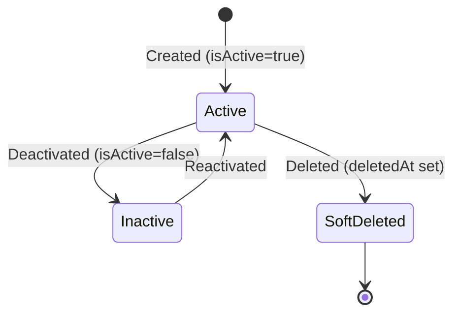

# Location Table

> **First documented**: 2026-01-30
> **Last updated**: 2026-01-30
> **Last verified by**: spec-executor (T018)
> **Verification status**: ✅ Documented from schema

---

## Overview

The `Location` table represents physical locations (kitchens, venues, warehouses) belonging to a tenant organization in the Convoy multi-tenant system. **This table is THE ONE table with a proper foreign key relationship to the Account (platform.accounts) table**, serving as the reference pattern for all tenant-scoped tables.

**Critical Design Pattern**: This table demonstrates the correct foreign key pattern:
- `tenantId` references `platform.accounts(id)` with `onDelete: Restrict`
- This prevents orphaned records and ensures referential integrity
- All other tenant tables should follow this pattern

**Business Context**: Locations are physical addresses where catering operations occur:
- **Primary Location**: The main kitchen/headquarters (flag: `isPrimary`)
- **Event Venues**: Off-site locations where events are served
- **Warehouses**: Storage facilities for inventory

**Key Use Cases**:
- Track all physical locations for a catering company
- Associate events with venues and preparation locations
- Calculate travel time between kitchen and event venues
- Manage inventory across multiple locations
- Support multi-location catering operations

**Lifecycle**: Created → Updated → Soft Deleted (never hard delete)

## Schema Reference

```sql
-- PostgreSQL schema reference
CREATE TABLE tenant.locations (
  tenant_id         UUID NOT NULL,
  id                UUID PRIMARY KEY DEFAULT gen_random_uuid(),
  name              VARCHAR NOT NULL,
  address_line1     VARCHAR,
  address_line2     VARCHAR,
  city              VARCHAR,
  state_province    VARCHAR,
  postal_code       VARCHAR,
  country_code      CHAR(2),
  timezone          VARCHAR,
  is_primary        BOOLEAN NOT NULL DEFAULT false,
  is_active         BOOLEAN NOT NULL DEFAULT true,
  created_at        TIMESTAMPTZ NOT NULL DEFAULT now(),
  updated_at        TIMESTAMPTZ NOT NULL DEFAULT now(),
  deleted_at        TIMESTAMPTZ,

  -- Foreign Key (THE REFERENCE PATTERN)
  CONSTRAINT fk_location_tenant FOREIGN KEY (tenant_id)
    REFERENCES platform.accounts(id)
    ON DELETE RESTRICT,

  -- Composite Primary Key
  CONSTRAINT pk_location PRIMARY KEY (tenant_id, id)
);

-- Indexes
CREATE INDEX idx_locations_tenant ON tenant.locations(tenant_id);
CREATE INDEX idx_locations_active ON tenant.locations(tenant_id, is_active)
  WHERE deleted_at IS NULL;

-- Prisma model reference
// File: packages/database/prisma/schema.prisma
// Model: Location (lines 99-123)
```

**Click-to-navigate**: Ctrl+click (Cmd+click on Mac) the Prisma schema path above to jump to the model definition.

## Columns

| Column | Type | Nullable | Default | Purpose | Notes |
|--------|------|----------|---------|---------|-------|
| `tenantId` | UUID | No | - | Tenant FK to Account | **THE REFERENCE PATTERN** - references platform.accounts(id), indexed |
| `id` | UUID | No | gen_random_uuid() | Primary key | Auto-generated, composite PK with tenantId |
| `name` | VARCHAR | No | - | Location name | Required, e.g., "Main Kitchen", "Downtown Venue" |
| `addressLine1` | VARCHAR | Yes | NULL | Street address | Optional but recommended for routing |
| `addressLine2` | VARCHAR | Yes | NULL | Suite/unit/apartment | Optional |
| `city` | VARCHAR | Yes | NULL | City name | Optional but recommended |
| `stateProvince` | VARCHAR | Yes | NULL | State or province | Optional, standard format |
| `postalCode` | VARCHAR | Yes | NULL | ZIP/postal code | Optional, for mapping/validation |
| `countryCode` | CHAR(2) | Yes | NULL | ISO 3166-1 alpha-2 | Optional, e.g., "US", "CA", "GB" |
| `timezone` | VARCHAR | Yes | NULL | IANA timezone | Optional, e.g., "America/New_York" |
| `isPrimary` | BOOLEAN | No | false | Primary location flag | Only one should be true per tenant |
| `isActive` | BOOLEAN | No | true | Active status | Inactive locations excluded from selections |
| `createdAt` | Timestamptz | No | now() | Creation timestamp | Auto-managed |
| `updatedAt` | Timestamptz | No | now() | Last update | Auto-managed |
| `deletedAt` | Timestamptz | Yes | NULL | Soft delete | Filter: `WHERE deleted_at IS NULL` |

### Column Details

#### `tenantId`
- **Type**: UUID
- **Nullable**: No
- **Purpose**: Foreign key to platform.accounts(id)
- **Validation**: Required, must exist in platform.accounts
- **Business rules**: THE REFERENCE PATTERN - all tenant tables should follow this FK pattern
- **Gotchas**: Uses `onDelete: Restrict` - cannot delete Account if Locations exist

#### `id`
- **Type**: UUID
- **Nullable**: No
- **Default**: gen_random_uuid()
- **Purpose**: Primary key (composite with tenantId)
- **Validation**: Auto-generated unique identifier
- **Gotchas**: Composite PK means (tenantId, id) is unique, not just id

#### `name`
- **Type**: VARCHAR
- **Nullable**: No
- **Purpose**: Human-readable location name
- **Validation**: Required, must be non-empty
- **Business rules**: Should be unique within tenant (enforced at app level)
- **Examples**: "Main Kitchen", "Downtown Warehouse", "Off-site Venue"

#### `timezone`
- **Type**: VARCHAR
- **Nullable**: Yes
- **Purpose**: Location-specific timezone for scheduling
- **Format**: IANA timezone database (e.g., "America/New_York", "Europe/London")
- **Business rules**: If null, defaults to Account.defaultTimezone
- **Usage**: Event timing, staff scheduling, reporting

#### `isPrimary`
- **Type**: BOOLEAN
- **Nullable**: No
- **Default**: false
- **Purpose**: Flags the primary/headquarters location
- **Business rules**: Only ONE location per tenant should have isPrimary=true
- **Validation**: Application-level constraint
- **Usage**: Default location for new events, primary warehouse for inventory

#### `isActive`
- **Type**: BOOLEAN
- **Nullable**: No
- **Default**: true
- **Purpose**: Flags whether location is active for operations
- **Business rules**: Inactive locations excluded from dropdowns, selections
- **Usage**: Seasonal venues, closed warehouses, temporary locations

#### `deletedAt`
- **Type**: TIMESTAMPTZ
- **Nullable**: Yes
- **Default**: NULL
- **Purpose**: Soft delete timestamp
- **Business rules**: Never hard delete locations - always soft delete
- **Usage**: Filter with `WHERE deleted_at IS NULL` for active records
- **Gotchas**: Existing references (Events, Shipments) remain valid

## Relations

### Foreign Key to Account (THE REFERENCE PATTERN)

- **Belongs to** [`Account`](../platform/Account.md) via `tenantId`
  - **Required**: Yes
  - **Cascade**: `onDelete: Restrict` (Cannot delete Account if Locations exist)
  - **Pattern**: This is THE reference pattern for all tenant tables
  - **Schema**: Cross-schema FK from `tenant.locations` → `platform.accounts`

### One-to-Many Relations

- **Has many** [`Event`](Event.md) via `eventsAsLocation` (locationId)
  - **Cascade**: `onDelete: SetNull` (Location deletion clears locationId)
  - **Purpose**: Events prepared at this location
  - **Business rule**: Location can be the prep kitchen for many events

- **Has many** [`Event`](Event.md) via `eventsAsVenue` (venueId)
  - **Cascade**: `onDelete: SetNull` (Location deletion clears venueId)
  - **Purpose**: Events served at this venue
  - **Business rule**: Location can be the venue for many events

- **Has many** `Shipment` via `locationId` (in tenant_inventory schema)
  - **Cascade**: Check shipment schema for delete behavior
  - **Purpose**: Shipments to/from this location

### Event Relationships (Critical)

The Location table is referenced TWICE by the Event table:

1. **locationId** → Event preparation location (kitchen)
   - Relation name: `"EventLocation"`
   - Usage: "This event was prepared at Main Kitchen"

2. **venueId** → Event service location (venue)
   - Relation name: `"LocationVenue"`
   - Usage: "This event was served at Downtown Venue"

**Example**: An event might be prepared at "Main Kitchen" (locationId) but served at "Client's Venue" (venueId).

### Cross-Schema

- **References** `platform.accounts` via `tenantId`
  - **Composite PK**: (tenant_id, id)
  - **FK Pattern**: THE standard for all tenant tables
  - **Migration**: Initial schema creation

## Business Rules

### Invariant Rules

1. **One Primary Location**: Only ONE location per tenant should have `isPrimary=true`
   - **Enforcement**: Application layer
   - **Violation**: Multiple primary locations cause confusion in defaults

2. **Referential Integrity**: Location cannot be deleted if Account doesn't exist
   - **Enforcement**: Database constraint (`onDelete: Restrict`)
   - **Violation**: FK constraint error

3. **Soft Delete Only**: Never hard delete locations
   - **Enforcement**: Application layer
   - **Violation**: Breaks historical event data, analytics

4. **Name Uniqueness**: Location names should be unique within tenant
   - **Enforcement**: Application layer
   - **Violation**: User confusion in dropdowns

### Data Integrity

- **Required fields**: tenantId, name
- **Uniqueness**: Composite (tenantId, id) is primary key
- **Referential integrity**: FK to platform.accounts is required
- **Soft deletes**: Use `deletedAt` to filter active locations

### Location State Machine



**Valid transitions**:
- Can be created as active or inactive
- Can toggle between active/inactive any number of times
- Once soft-deleted, should not be reactivated (create new instead)

## Type Fixing

### Type Mismatches Found

No type mismatches found during documentation.

- Location table schema is consistent between Prisma and expected PostgreSQL types
- All columns properly typed with nullable/required correctly specified
- Foreign key relationship properly defined

### Nullability Issues

No nullability issues found.

- `tenantId` is correctly marked as required (non-nullable)
- `id` is correctly marked as required (non-nullable)
- `name` is correctly marked as required (non-nullable)
- Optional fields (address, timezone) correctly nullable

### TODOs: Type Issues

None - Location table is properly typed.

## Queries

### Fetch All Active Locations for Tenant

```typescript
// Prisma
await database.location.findMany({
  where: {
    tenantId,
    deletedAt: null,
    isActive: true
  },
  orderBy: { name: 'asc' }
});

// SQL
SELECT *
FROM tenant.locations
WHERE tenant_id = $1
  AND deleted_at IS NULL
  AND is_active = true
ORDER BY name ASC;
```

**Index used**: `idx_locations_tenant`, `idx_locations_active`

### Fetch Primary Location

```typescript
// Prisma
await database.location.findFirst({
  where: {
    tenantId,
    isPrimary: true,
    deletedAt: null
  }
});

// SQL
SELECT *
FROM tenant.locations
WHERE tenant_id = $1
  AND is_primary = true
  AND deleted_at IS NULL
LIMIT 1;
```

**Business rule**: Should return exactly one location per tenant.

### Fetch Location with Event Count

```typescript
// Prisma
await database.location.findMany({
  where: { tenantId, deletedAt: null },
  include: {
    _count: {
      select: {
        eventsAsLocation: true,
        eventsAsVenue: true
      }
    }
  }
});

// SQL
SELECT
  l.*,
  COUNT(DISTINCT el.id) as events_as_location_count,
  COUNT(DISTINCT ev.id) as events_as_venue_count
FROM tenant.locations l
LEFT JOIN tenant.events el ON el.location_id = l.id AND el.deleted_at IS NULL
LEFT JOIN tenant.events ev ON ev.venue_id = l.id AND ev.deleted_at IS NULL
WHERE l.tenant_id = $1 AND l.deleted_at IS NULL
GROUP BY l.id;
```

**Usage**: Dashboard showing location utilization.

### Create New Location

```typescript
// Prisma
await database.location.create({
  data: {
    tenantId,
    name: "Downtown Warehouse",
    addressLine1: "123 Main St",
    city: "Springfield",
    stateProvince: "IL",
    postalCode: "62701",
    countryCode: "US",
    timezone: "America/Chicago",
    isPrimary: false,
    isActive: true
  }
});

// SQL
INSERT INTO tenant.locations (
  tenant_id, id, name, address_line1, city, state_province,
  postal_code, country_code, timezone, is_primary, is_active
) VALUES (
  $1, gen_random_uuid(), $2, $3, $4, $5, $6, $7, $8, false, true
);
```

### Update Location

```typescript
// Prisma
await database.location.update({
  where: {
    tenantId_id: {
      tenantId,
      id: locationId
    }
  },
  data: {
    name: "Updated Location Name",
    isActive: false
  }
});

// SQL
UPDATE tenant.locations
SET name = $1, is_active = false, updated_at = now()
WHERE tenant_id = $2 AND id = $3;
```

**Note**: Prisma uses composite key format `tenantId_id` for where clause.

### Soft Delete Location

```typescript
// Prisma
await database.location.update({
  where: {
    tenantId_id: { tenantId, id: locationId }
  },
  data: {
    deletedAt: new Date()
  }
});

// SQL
UPDATE tenant.locations
SET deleted_at = now(), updated_at = now()
WHERE tenant_id = $1 AND id = $2;
```

**Behavior**: Sets deletedAt timestamp, doesn't hard delete.

### Gotchas

1. **Composite Primary Key**: Always query with both `tenantId` and `id`:
   ```typescript
   // Correct
   where: { tenantId_id: { tenantId, id } }

   // Wrong (will fail)
   where: { id: locationId }
   ```

2. **Referenced by Events**: Locations are referenced by Event.locationId and Event.venueId:
   - Cannot hard delete locations referenced by events
   - Use soft delete to preserve event history

3. **Primary Location Uniqueness**: Application must enforce only one `isPrimary=true`:
   - When setting new location as primary, set others to false
   - Use transaction to prevent race conditions

4. **Timezone Handling**: Location timezone defaults to Account timezone:
   - Always check if location.timezone is null
   - Fall back to account.defaultTimezone for null values

## TODOs

### High Priority

None - Location table is well-designed and properly documented.

### Medium Priority

```markdown
- [ ] [P2] Add unique constraint on name within tenant - prevents duplicate names
- [ ] [P2] Add trigger to enforce single isPrimary location per tenant
```

### Low Priority

```markdown
- [ ] [P3] Consider geolocation columns (lat/long) for mapping features
- [ ] [P3] Add location type enum (kitchen, warehouse, venue, office)
```

### Migration Required

None - Location table schema is stable.

## Related Tables

- [`Account`](../platform/Account.md) - Parent table (tenant), THE FK reference pattern
- [`Event`](Event.md) - References Location twice (locationId for prep, venueId for service)
- `Shipment` - References Location (in tenant_inventory schema)

## Related Code

- **Prisma Model**: [`packages/database/prisma/schema.prisma`](../../../packages/database/prisma/schema.prisma#L99-123)
- **Business Logic**: `apps/app/app/(authenticated)/inventory/` (location-based inventory)
- **API Routes**: `apps/app/app/api/locations/` (if exists)
- **Tests**: `apps/app/__tests__/locations.test.ts` (if exists)

## Usage Examples

### Event Location Pattern

```typescript
// Create event with both prep location and venue
const event = await database.event.create({
  data: {
    tenantId,
    title: "Wedding Reception",
    eventDate: new Date("2026-06-15"),
    locationId: mainKitchenId,  // Prepared at Main Kitchen
    venueId: venueLocationId,    // Served at Downtown Venue
  }
});

// Query with location details
const eventWithLocations = await database.event.findUnique({
  where: { id: eventId },
  include: {
    location: true,  // Prep location
    venue: true      // Service location
  }
});
```

### Multi-Location Inventory

```typescript
// Fetch stock across all locations
const stockLevels = await database.inventoryStock.findMany({
  where: {
    location: {
      tenantId,
      isActive: true,
      deletedAt: null
    }
  },
  include: {
    location: true,
    item: true
  }
});

// Transfer stock between locations
await database.$transaction([
  // Decrease source
  database.inventoryStock.update({
    where: { locationId_itemId: { locationId: source, itemId } },
    data: { quantityOnHand: { decrement: quantity } }
  }),
  // Increase destination
  database.inventoryStock.update({
    where: { locationId_itemId: { locationId: dest, itemId } },
    data: { quantityOnHand: { increment: quantity } }
  })
]);
```

### Primary Location Default

```typescript
// Get or create primary location for tenant
let primaryLocation = await database.location.findFirst({
  where: {
    tenantId,
    isPrimary: true,
    deletedAt: null
  }
});

if (!primaryLocation) {
  // Create default primary location
  primaryLocation = await database.location.create({
    data: {
      tenantId,
      name: "Main Kitchen",
      isPrimary: true,
      isActive: true
    }
  });
}

// Use as default for new events
const event = await database.event.create({
  data: {
    tenantId,
    title: "New Event",
    locationId: primaryLocation.id  // Default to primary
  }
});
```

## See Also

- **Schema Documentation**: [`../schemas/02-tenant.md`](../schemas/02-tenant.md)
- **Schema Overview**: [`../SCHEMAS.md`](../SCHEMAS.md)
- **Known Issues**: [`../KNOWN_ISSUES.md`](../KNOWN_ISSUES.md)
- **Migration History**: [`../migrations/README.md`](../migrations/README.md)
- **Table Template**: [`../_templates/table-doc-template.md`](../_templates/table-doc-template.md)
