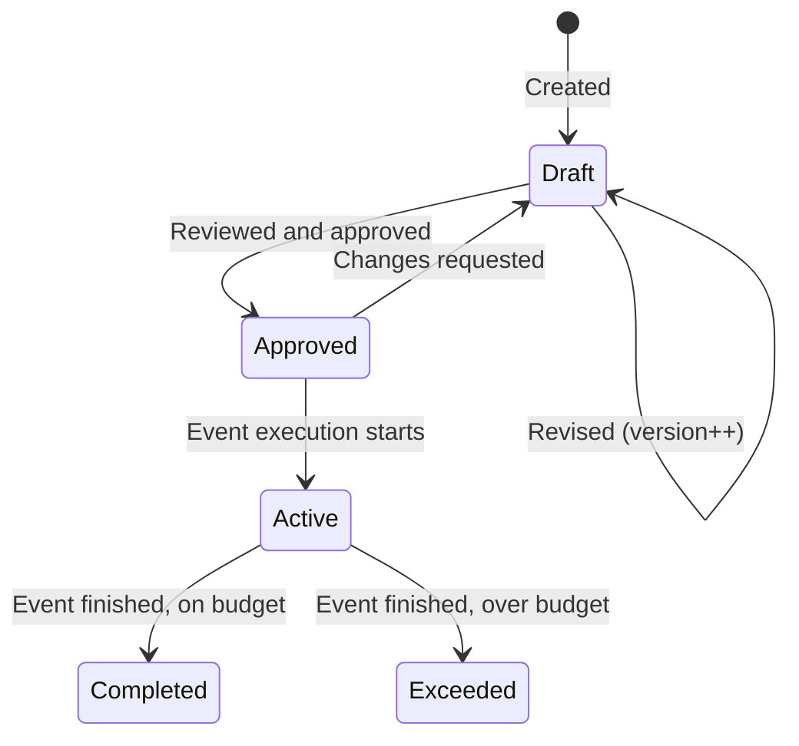

# EventBudget Table

> **First documented**: 2026-01-30
> **Last updated**: 2026-01-30
> **Last verified by**: spec-executor (T024)
> **Verification status**: ✅ Documented from schema

---

## Overview

The `EventBudget` table tracks budget versus actual spending for events in the Convoy catering management system. Each event can have multiple budget versions, with line items tracking categorized expenses (venue, catering, beverages, labor, equipment, other).

**Critical Design Patterns**:

1. **Versioning**: The `version` field supports budget revisions while preserving history
2. **Variance Tracking**: Real-time calculation of budget vs. actual differences
3. **Line Item Relations**: One-to-many relationship with `BudgetLineItem` for detailed tracking
4. **Status Workflow**: draft → approved → active → completed/exceeded

**Business Context**:
- **Budget Planning**: Create initial budget estimates before event execution
- **Cost Tracking**: Monitor actual spending against budgeted amounts
- **Variance Analysis**: Identify over/under budget scenarios with percentage calculations
- **Multi-Version Support**: Maintain budget revision history (version 1, 2, 3...)

**Key Use Cases**:
- Create detailed event budgets with categorized line items
- Track actual expenses as invoices are paid
- Calculate variance amounts and percentages automatically
- Generate budget reports for client billing
- Alert when budgets are exceeded (via BudgetAlert relation)

**Lifecycle**: Draft → Approved → Active → Completed/Exceeded

## Schema Reference

```sql
-- PostgreSQL schema reference
CREATE TABLE tenant_events.event_budgets (
  tenant_id            UUID NOT NULL,
  id                   UUID PRIMARY KEY DEFAULT gen_random_uuid(),
  event_id             UUID NOT NULL,
  version              INTEGER NOT NULL DEFAULT 1,
  status               VARCHAR NOT NULL DEFAULT 'draft',
  total_budget_amount  DECIMAL(12,2) NOT NULL DEFAULT 0,
  total_actual_amount  DECIMAL(12,2) NOT NULL DEFAULT 0,
  variance_amount      DECIMAL(12,2) NOT NULL DEFAULT 0,
  variance_percentage  DECIMAL(5,2) NOT NULL DEFAULT 0,
  notes                TEXT,
  created_at           TIMESTAMPTZ NOT NULL DEFAULT now(),
  updated_at           TIMESTAMPTZ NOT NULL DEFAULT now(),
  deleted_at           TIMESTAMPTZ,

  -- Foreign Keys
  CONSTRAINT fk_budget_tenant FOREIGN KEY (tenant_id)
    REFERENCES platform.accounts(id)
    ON DELETE RESTRICT,

  CONSTRAINT fk_budget_event FOREIGN KEY (event_id)
    REFERENCES tenant_events.events(id)
    ON DELETE CASCADE,

  -- Composite Primary Key
  CONSTRAINT pk_event_budget PRIMARY KEY (tenant_id, id)
);

-- Indexes
CREATE INDEX event_budgets_event_id_idx ON tenant_events.event_budgets(tenant_id, event_id);
CREATE INDEX event_budgets_status_idx ON tenant_events.event_budgets(tenant_id, status);

-- Prisma model reference
// File: packages/database/prisma/schema.prisma
// Model: EventBudget (lines 442-466)
```

**Click-to-navigate**: Ctrl+click (Cmd+click on Mac) the Prisma schema path above to jump to the model definition.

## Columns

| Column | Type | Nullable | Default | Purpose | Notes |
|--------|------|----------|---------|---------|-------|
| `tenantId` | UUID | No | - | Tenant FK to Account | References platform.accounts(id), indexed |
| `id` | UUID | No | gen_random_uuid() | Primary key | Auto-generated, composite PK with tenantId |
| `eventId` | UUID | No | - | Event FK | References tenant_events.events(id), cascade delete |
| `version` | INTEGER | No | 1 | Budget version number | Increment for revisions (1, 2, 3...) |
| `status` | VARCHAR | No | 'draft' | Budget status | Enum: draft, approved, active, completed, exceeded |
| `totalBudgetAmount` | DECIMAL(12,2) | No | 0 | Total budgeted amount | Sum of all line item budgeted amounts |
| `totalActualAmount` | DECIMAL(12,2) | No | 0 | Total actual spent | Sum of all line item actual amounts |
| `varianceAmount` | DECIMAL(12,2) | No | 0 | Budget - Actual difference | Negative = over budget, positive = under |
| `variancePercentage` | DECIMAL(5,2) | No | 0 | Variance as percentage | (variance / budget) * 100 |
| `notes` | TEXT | Yes | NULL | Additional notes | Optional context for budget |
| `createdAt` | TIMESTAMptz | No | now() | Creation timestamp | Auto-managed |
| `updatedAt` | TIMESTAMptz | No | now() | Last update | Auto-managed |
| `deletedAt` | TIMESTAMptz | Yes | NULL | Soft delete | Filter: `WHERE deleted_at IS NULL` |

### Column Details

#### `tenantId`
- **Type**: UUID
- **Nullable**: No
- **Purpose**: Foreign key to platform.accounts(id)
- **Validation**: Required, must exist in platform.accounts
- **Business rules**: Multi-tenancy isolation - queries must filter by tenantId
- **Gotchas**: Uses `onDelete: Restrict` - cannot delete Account if EventBudgets exist

#### `id`
- **Type**: UUID
- **Nullable**: No
- **Default**: gen_random_uuid()
- **Purpose**: Primary key (composite with tenantId)
- **Validation**: Auto-generated unique identifier
- **Gotchas**: Composite PK means (tenantId, id) is unique, not just id

#### `eventId`
- **Type**: UUID
- **Nullable**: No
- **Purpose**: Foreign key to tenant_events.events(id)
- **Validation**: Required, must exist in tenant_events.events
- **Business rules**: One event can have multiple budget versions
- **Cascade**: `onDelete: Cascade` - deleting event deletes all budgets
- **Gotchas**: Query with `include: { lineItems: true }` to get full budget data

#### `version`
- **Type**: INTEGER
- **Nullable**: No
- **Default**: 1
- **Purpose**: Track budget revisions
- **Business rules**:
  - Initial budget = version 1
  - Revisions increment version (2, 3, 4...)
  - Only one version should be "active" at a time
- **Usage**: Compare budget versions, track approval history
- **Gotchas**: Application must enforce single active version per event

#### `status`
- **Type**: VARCHAR
- **Nullable**: No
- **Default**: 'draft'
- **Purpose**: Budget workflow status
- **Valid values**: draft, approved, active, completed, exceeded
- **Status transitions**:
  ```
  draft → approved → active → completed
                              → exceeded
  ```
- **Business rules**:
  - Only active budgets are used for variance calculations
  - Exceeded status triggers alerts via BudgetAlert relation
  - Completed budgets are locked (no further updates)

#### `totalBudgetAmount`
- **Type**: DECIMAL(12,2)
- **Nullable**: No
- **Default**: 0
- **Purpose**: Sum of all line item budgeted amounts
- **Calculation**: Should equal `SUM(lineItems.budgetedAmount)`
- **Business rules**: Must be >= 0
- **Gotchas**: Can be set manually OR calculated from line items

#### `totalActualAmount`
- **Type**: DECIMAL(12,2)
- **Nullable**: No
- **Default**: 0
- **Purpose**: Sum of all line item actual amounts
- **Calculation**: Should equal `SUM(lineItems.actualAmount)`
- **Business rules**: Must be >= 0
- **Usage**: Updated as invoices are paid or costs incurred

#### `varianceAmount`
- **Type**: DECIMAL(12,2)
- **Nullable**: No
- **Default**: 0
- **Purpose**: Budget vs. actual difference
- **Calculation**: `totalBudgetAmount - totalActualAmount`
- **Interpretation**:
  - Positive: Under budget (good)
  - Negative: Over budget (bad)
  - Zero: On budget
- **Gotchas**: Should be recalculated when line items change

#### `variancePercentage`
- **Type**: DECIMAL(5,2)
- **Nullable**: No
- **Default**: 0
- **Purpose**: Variance as percentage of budget
- **Calculation**: `(varianceAmount / totalBudgetAmount) * 100`
- **Business rules**: NULL if totalBudgetAmount = 0 (avoid division by zero)
- **Usage**: Quick visual indicator in UI (green for positive, red for negative)

#### `deletedAt`
- **Type**: TIMESTAMPTZ
- **Nullable**: Yes
- **Default**: NULL
- **Purpose**: Soft delete timestamp
- **Business rules**: Never hard delete budgets - always soft delete
- **Usage**: Filter with `WHERE deleted_at IS NULL` for active records
- **Gotchas**: Existing line items remain valid but should also be soft-deleted

## Relations

### Foreign Key to Account

- **Belongs to** [`Account`](../platform/Account.md) via `tenantId`
  - **Required**: Yes
  - **Cascade**: `onDelete: Restrict` (Cannot delete Account if EventBudgets exist)
  - **Pattern**: Standard multi-tenancy FK pattern
  - **Schema**: Cross-schema FK from `tenant_events.event_budgets` → `platform.accounts`

### Foreign Key to Event

- **Belongs to** [`Event`](../tenant_events/Event.md) via `eventId`
  - **Required**: Yes
  - **Cascade**: `onDelete: Cascade` (Deleting event deletes all budgets)
  - **Purpose**: Associate budget with specific event
  - **Business rule**: One event can have multiple budget versions

### One-to-Many Relations

- **Has many** [`BudgetLineItem`](../tenant_events/BudgetLineItem.md) via `lineItems` relation
  - **Cascade**: `onDelete: Cascade` (Budget deletion deletes line items)
  - **Purpose**: Detailed breakdown of budget by category
  - **Categories**: venue, catering, beverages, labor, equipment, other

- **Has many** `BudgetAlert` via `alerts` relation
  - **Cascade**: Check BudgetAlert schema for delete behavior
  - **Purpose**: Notifications when budget thresholds exceeded
  - **Triggers**: Variance exceeds threshold, status changes to "exceeded"

### Cross-Schema

- **References** `platform.accounts` via `tenantId`
  - **Composite PK**: (tenant_id, id)
  - **FK Pattern**: Standard multi-tenancy pattern
  - **Migration**: Initial schema creation (see migration history)

- **References** `tenant_events.events` via `eventId`
  - **Cascade delete**: Automatic cleanup of budgets when event deleted
  - **Index**: `event_budgets_event_id_idx` for efficient queries

## Business Rules

### Invariant Rules

1. **One Active Budget Per Event**: Only ONE budget version should be "active" at a time
   - **Enforcement**: Application layer
   - **Violation**: Conflicting budget data in reports

2. **Variance Calculation Consistency**: varianceAmount must equal totalBudgetAmount - totalActualAmount
   - **Enforcement**: Application layer (recalculate on updates)
   - **Violation**: Incorrect variance percentages in UI

3. **Version Sequencing**: Versions must increment sequentially (1, 2, 3...)
   - **Enforcement**: Application layer
   - **Violation**: Gaps or duplicates in version history

4. **Status Transition Rules**: Budget status must follow valid transitions
   - **Enforcement**: Application layer
   - **Valid transitions**: draft → approved → active → (completed | exceeded)
   - **Violation**: Invalid workflow states

5. **Referential Integrity**: EventBudget cannot exist without Event
   - **Enforcement**: Database constraint (`onDelete: Cascade`)
   - **Violation**: FK constraint error

### Data Integrity

- **Required fields**: tenantId, eventId, version, status
- **Uniqueness**: Composite (tenantId, id) is primary key
- **Referential integrity**: FK to platform.accounts and tenant_events.events
- **Soft deletes**: Use `deletedAt` to filter active budgets
- **Decimal precision**: Use DECIMAL(12,2) for amounts to avoid floating-point errors

### Budget Status Machine



**Valid transitions**:
- Draft → Approved (budget reviewed and approved)
- Approved → Active (event execution begins)
- Active → Completed (event finished within budget)
- Active → Exceeded (event finished over budget)
- Draft → Draft (revision, increment version)
- Approved → Draft (changes requested, increment version)

**Invalid transitions**:
- Completed → Active (cannot reopen completed budgets)
- Exceeded → Draft (exceeded budgets should be archived, not revised)

## Versioning Strategy

### Multi-Version Budget Pattern

The `version` field supports budget revisions while preserving history:

```typescript
// Create initial budget (version 1)
const budgetV1 = await database.eventBudget.create({
  data: {
    tenantId,
    eventId,
    version: 1,
    status: 'draft',
    totalBudgetAmount: 10000,
    totalActualAmount: 0,
    varianceAmount: 10000,
    variancePercentage: 100
  }
});

// Create revision (version 2)
const budgetV2 = await database.eventBudget.create({
  data: {
    tenantId,
    eventId,
    version: 2,  // Incremented
    status: 'draft',
    totalBudgetAmount: 12000,  // Updated amount
    totalActualAmount: 0,
    varianceAmount: 12000,
    variancePercentage: 100
  }
});

// Activate version 2, deactivate version 1
await database.$transaction([
  database.eventBudget.update({
    where: { id: budgetV1.id },
    data: { status: 'superseded' }  // Mark old version
  }),
  database.eventBudget.update({
    where: { id: budgetV2.id },
    data: { status: 'active' }  // Activate new version
  })
]);
```

### Version Query Pattern

```typescript
// Fetch all versions for an event
const allVersions = await database.eventBudget.findMany({
  where: {
    tenantId,
    eventId,
    deletedAt: null
  },
  orderBy: { version: 'desc' }  // Latest first
});

// Fetch active version only
const activeBudget = await database.eventBudget.findFirst({
  where: {
    tenantId,
    eventId,
    status: 'active',
    deletedAt: null
  }
});

// Fetch version history for comparison
const versionHistory = await database.eventBudget.findMany({
  where: {
    tenantId,
    eventId,
    deletedAt: null
  },
  select: {
    version: true,
    totalBudgetAmount: true,
    status: true,
    createdAt: true
  },
  orderBy: { version: 'asc' }
});
```

## Line Item Relations

### BudgetLineItem Categories

Each budget can have multiple line items, categorized as:

| Category | Description | Examples |
|----------|-------------|----------|
| `venue` | Venue rental fees | Facility rental, room setup |
| `catering` | Food and beverage costs | Ingredients, plating, service |
| `beverages` | Bar and beverage costs | Alcohol, mixers, bar service |
| `labor` | Staffing costs | Chefs, servers, bartenders |
| `equipment` | Equipment rental | Linens, flatware, glassware |
| `other` | Miscellaneous costs | Decorations, entertainment |

### Line Item Aggregation

```typescript
// Fetch budget with line items
const budgetWithItems = await database.eventBudget.findUnique({
  where: {
    tenantId_id: { tenantId, id: budgetId }
  },
  include: {
    lineItems: {
      where: { deletedAt: null },
      orderBy: { sortOrder: 'asc' }
    }
  }
});

// Calculate totals from line items
const calculatedBudget = budgetWithItems.lineItems.reduce(
  (acc, item) => ({
    budgeted: acc.budgeted + item.budgetedAmount,
    actual: acc.actual + item.actualAmount
  }),
  { budgeted: 0, actual: 0 }
);

// Verify consistency
if (budgetWithItems.totalBudgetAmount !== calculatedBudget.budgeted) {
  console.warn('Budget total inconsistent with line items');
}
```

### Variance Calculation

```typescript
// Calculate variance from line items
const lineItemVariance = budgetWithItems.lineItems.reduce(
  (acc, item) => {
    const itemVariance = item.budgetedAmount - item.actualAmount;
    return {
      totalVariance: acc.totalVariance + itemVariance,
      totalBudget: acc.totalBudget + item.budgetedAmount
    };
  },
  { totalVariance: 0, totalBudget: 0 }
);

const calculatedVarianceAmount = lineItemVariance.totalVariance;
const calculatedVariancePercentage = lineItemVariance.totalBudget > 0
  ? (lineItemVariance.totalVariance / lineItemVariance.totalBudget) * 100
  : 0;

// Update budget with recalculated variance
await database.eventBudget.update({
  where: { id: budgetId },
  data: {
    varianceAmount: calculatedVarianceAmount,
    variancePercentage: calculatedVariancePercentage
  }
});
```

## Type Fixing

### Type Mismatches Found

No type mismatches found during documentation.

- EventBudget table schema is consistent between Prisma and expected PostgreSQL types
- All columns properly typed with nullable/required correctly specified
- Foreign key relationships properly defined

### Nullability Issues

No nullability issues found.

- `tenantId` is correctly marked as required (non-nullable)
- `id` is correctly marked as required (non-nullable)
- `eventId` is correctly marked as required (non-nullable)
- `version` is correctly marked as required (non-nullable)
- `status` is correctly marked as required (non-nullable)
- Optional fields (notes, deletedAt) correctly nullable

### TODOs: Type Issues

None - EventBudget table is properly typed.

## Queries

### Fetch Active Budget for Event

```typescript
// Prisma
const activeBudget = await database.eventBudget.findFirst({
  where: {
    tenantId,
    eventId,
    status: 'active',
    deletedAt: null
  },
  include: {
    lineItems: {
      where: { deletedAt: null },
      orderBy: { sortOrder: 'asc' }
    }
  }
});

// SQL
SELECT
  eb.*,
  li.id as li_id,
  li.category,
  li.name,
  li.budgeted_amount,
  li.actual_amount,
  li.variance_amount,
  li.sort_order
FROM tenant_events.event_budgets eb
LEFT JOIN tenant_events.budget_line_items li
  ON li.budget_id = eb.id
  AND li.deleted_at IS NULL
WHERE eb.tenant_id = $1
  AND eb.event_id = $2
  AND eb.status = 'active'
  AND eb.deleted_at IS NULL
ORDER BY li.sort_order ASC;
```

**Index used**: `event_budgets_event_id_idx`, `event_budgets_status_idx`

### Fetch All Budget Versions for Event

```typescript
// Prisma
const budgetHistory = await database.eventBudget.findMany({
  where: {
    tenantId,
    eventId,
    deletedAt: null
  },
  orderBy: { version: 'desc' }
});

// SQL
SELECT *
FROM tenant_events.event_budgets
WHERE tenant_id = $1
  AND event_id = $2
  AND deleted_at IS NULL
ORDER BY version DESC;
```

**Usage**: Version comparison, budget approval history.

### Fetch Exceeded Budgets

```typescript
// Prisma
const exceededBudgets = await database.eventBudget.findMany({
  where: {
    tenantId,
    status: 'exceeded',
    deletedAt: null
  },
  include: {
    event: {
      select: { title: true, eventDate: true }
    },
    alerts: true
  },
  orderBy: { updatedAt: 'desc' }
});

// SQL
SELECT
  eb.*,
  e.title as event_title,
  e.event_date
FROM tenant_events.event_budgets eb
JOIN tenant_events.events e ON e.id = eb.event_id
WHERE eb.tenant_id = $1
  AND eb.status = 'exceeded'
  AND eb.deleted_at IS NULL
ORDER BY eb.updated_at DESC;
```

**Usage**: Alert dashboard, variance analysis.

### Create Budget with Line Items

```typescript
// Prisma (transaction)
const budget = await database.$transaction(async (tx) => {
  const newBudget = await tx.eventBudget.create({
    data: {
      tenantId,
      eventId,
      version: 1,
      status: 'draft',
      totalBudgetAmount: 0,  // Calculated from line items
      totalActualAmount: 0,
      varianceAmount: 0,
      variancePercentage: 0
    }
  });

  await tx.budgetLineItem.createMany({
    data: [
      {
        tenantId,
        budgetId: newBudget.id,
        category: 'venue',
        name: 'Venue Rental',
        budgetedAmount: 2000,
        actualAmount: 0,
        varianceAmount: 2000,
        sortOrder: 1
      },
      {
        tenantId,
        budgetId: newBudget.id,
        category: 'catering',
        name: 'Food & Beverage',
        budgetedAmount: 5000,
        actualAmount: 0,
        varianceAmount: 5000,
        sortOrder: 2
      }
    ]
  });

  // Calculate total from line items
  const lineItemsTotal = 2000 + 5000;

  return await tx.eventBudget.update({
    where: { id: newBudget.id },
    data: {
      totalBudgetAmount: lineItemsTotal,
      varianceAmount: lineItemsTotal,
      variancePercentage: 100
    }
  });
});

// SQL (simplified)
BEGIN;

INSERT INTO tenant_events.event_budgets (
  tenant_id, id, event_id, version, status,
  total_budget_amount, total_actual_amount,
  variance_amount, variance_percentage
) VALUES (
  $1, gen_random_uuid(), $2, 1, 'draft', 0, 0, 0, 0
);

INSERT INTO tenant_events.budget_line_items (
  tenant_id, budget_id, category, name,
  budgeted_amount, actual_amount, variance_amount, sort_order
) VALUES
  ($1, $3, 'venue', 'Venue Rental', 2000, 0, 2000, 1),
  ($1, $3, 'catering', 'Food & Beverage', 5000, 0, 5000, 2);

UPDATE tenant_events.event_budgets
SET total_budget_amount = 7000,
    variance_amount = 7000,
    variance_percentage = 100
WHERE id = $3;

COMMIT;
```

### Update Actual Amounts and Recalculate Variance

```typescript
// Prisma
const updatedBudget = await database.$transaction(async (tx) => {
  // Update line item actual amounts
  await tx.budgetLineItem.updateMany({
    where: {
      tenantId,
      budgetId
    },
    data: {
      actualAmount: 5200,  // Example: Catering cost increased
      varianceAmount: -200  // Over budget by $200
    }
  });

  // Recalculate budget totals
  const lineItems = await tx.budgetLineItem.findMany({
    where: { tenantId, budgetId, deletedAt: null }
  });

  const totals = lineItems.reduce(
    (acc, item) => ({
      budgeted: acc.budgeted + item.budgetedAmount,
      actual: acc.actual + item.actualAmount
    }),
    { budgeted: 0, actual: 0 }
  );

  const varianceAmount = totals.budgeted - totals.actual;
  const variancePercentage = totals.budgeted > 0
    ? (varianceAmount / totals.budgeted) * 100
    : 0;

  // Update budget summary
  return await tx.eventBudget.update({
    where: { id: budgetId },
    data: {
      totalActualAmount: totals.actual,
      varianceAmount,
      variancePercentage,
      status: varianceAmount < 0 ? 'exceeded' : 'active'
    }
  });
});

// SQL (simplified)
BEGIN;

UPDATE tenant_events.budget_line_items
SET actual_amount = 5200,
    variance_amount = -200
WHERE budget_id = $1;

UPDATE tenant_events.event_budgets eb
SET total_actual_amount = (
    SELECT COALESCE(SUM(actual_amount), 0)
    FROM tenant_events.budget_line_items
    WHERE budget_id = eb.id
    AND deleted_at IS NULL
  ),
  variance_amount = total_budget_amount - (
    SELECT COALESCE(SUM(actual_amount), 0)
    FROM tenant_events.budget_line_items
    WHERE budget_id = eb.id
    AND deleted_at IS NULL
  ),
  variance_percentage = CASE
    WHEN total_budget_amount > 0 THEN
      ((total_budget_amount - (
        SELECT COALESCE(SUM(actual_amount), 0)
        FROM tenant_events.budget_line_items
        WHERE budget_id = eb.id
        AND deleted_at IS NULL
      )) / total_budget_amount) * 100
    ELSE 0
  END,
  status = CASE
    WHEN (total_budget_amount - (
      SELECT COALESCE(SUM(actual_amount), 0)
      FROM tenant_events.budget_line_items
      WHERE budget_id = eb.id
      AND deleted_at IS NULL
    )) < 0 THEN 'exceeded'
    ELSE 'active'
  END
WHERE id = $1;

COMMIT;
```

### Gotchas

1. **Composite Primary Key**: Always query with both `tenantId` and `id`:
   ```typescript
   // Correct
   where: { tenantId_id: { tenantId, id } }

   // Wrong (will fail)
   where: { id: budgetId }
   ```

2. **Variance Calculation**: Must recalculate when line items change:
   - Update `totalActualAmount` = SUM(lineItems.actualAmount)
   - Update `varianceAmount` = totalBudgetAmount - totalActualAmount
   - Update `variancePercentage` = (varianceAmount / totalBudgetAmount) * 100
   - Handle division by zero (if totalBudgetAmount = 0)

3. **Status Management**: Application must enforce valid status transitions:
   - Use transactions when updating status and line items together
   - Check current status before allowing transitions
   - Validate only one "active" budget per event

4. **Version Management**: Application must enforce sequential versions:
   - Query max version for event before creating new version
   - Use transaction to prevent race conditions
   - Mark old versions as "superseded" when activating new version

5. **Soft Delete Cascade**: When soft-deleting budget, also soft-delete line items:
   ```typescript
   await database.$transaction([
     database.budgetLineItem.updateMany({
       where: { budgetId },
       data: { deletedAt: new Date() }
     }),
     database.eventBudget.update({
       where: { id: budgetId },
       data: { deletedAt: new Date() }
     })
   ]);
   ```

## TODOs

### High Priority

```markdown
- [ ] [P1] Add database trigger to auto-calculate variance on line item updates
  - **Problem**: Variance calculation currently application-level
  - **Solution**: PostgreSQL trigger function to recalculate totals
  - **Benefit**: Consistent variance data regardless of update path
  - **Migration**: Create trigger function in tenant_events schema
```

### Medium Priority

```markdown
- [ ] [P2] Add unique constraint on (eventId, version) - prevents duplicate versions
- [ ] [P2] Add check constraint to enforce only one active budget per event
- [ ] [P2] Add computed column for utilization percentage (actual / budget * 100)
```

### Low Priority

```markdown
- [ ] [P3] Add budget approval workflow (approvedBy, approvedAt fields)
- [ ] [P3] Add budget lock flag to prevent modifications after completion
- [ ] [P3] Consider currency support for international events
```

### Migration Required

```markdown
- [ ] [P2] **VARIANCE CALCULATION OPTIMIZATION**
  - **Current**: Variance calculated in application layer
  - **Issue**: Manual updates may forget to recalculate
  - **Solution**: Add PostgreSQL triggers for automatic variance calculation
  - **Migration**: `20260131_add_budget_variance_triggers`
  - **Impact**: Improves data consistency, reduces application logic

  Example trigger:
  ```sql
  CREATE OR REPLACE FUNCTION tenant_events.recalculate_budget_variance()
  RETURNS TRIGGER AS $$
  DECLARE
    v_total_actual DECIMAL(12,2);
    v_variance DECIMAL(12,2);
    v_percentage DECIMAL(5,2);
  BEGIN
    -- Calculate totals from line items
    SELECT COALESCE(SUM(actual_amount), 0)
    INTO v_total_actual
    FROM tenant_events.budget_line_items
    WHERE budget_id = NEW.budget_id AND deleted_at IS NULL;

    -- Calculate variance
    v_variance := OLD.total_budget_amount - v_total_actual;
    v_percentage := CASE
      WHEN OLD.total_budget_amount > 0 THEN
        (v_variance / OLD.total_budget_amount) * 100
      ELSE 0
    END;

    -- Update budget
    UPDATE tenant_events.event_budgets
    SET total_actual_amount = v_total_actual,
        variance_amount = v_variance,
        variance_percentage = v_percentage,
        status = CASE
          WHEN v_variance < 0 THEN 'exceeded'
          ELSE OLD.status
        END
    WHERE id = OLD.id;

    RETURN NEW;
  END;
  $$ LANGUAGE plpgsql;

  CREATE TRIGGER trigger_recalculate_budget_variance
  AFTER UPDATE ON tenant_events.budget_line_items
  FOR EACH ROW
  EXECUTE FUNCTION tenant_events.recalculate_budget_variance();
  ```
```

## Related Tables

- [`Account`](../platform/Account.md) - Parent table (tenant), FK reference
- [`Event`](../tenant_events/Event.md) - Parent table (event), cascade delete
- [`BudgetLineItem`](../tenant_events/BudgetLineItem.md) - Child table (line items), cascade delete
- [`BudgetAlert`](../tenant_events/BudgetAlert.md) - Child table (alerts), check schema for delete behavior

## Related Code

- **Prisma Model**: [`packages/database/prisma/schema.prisma`](../../../packages/database/prisma/schema.prisma#L442-466)
- **Generated Types**: [`packages/database/generated/models/event_budgets.ts`](../../../packages/database/generated/models/event_budgets.ts)
- **API Routes**: [`apps/api/app/api/events/budgets/route.ts`](../../../apps/api/app/api/events/budgets/route.ts)
- **Validation**: [`apps/api/app/api/events/budgets/validation.ts`](../../../apps/api/app/api/events/budgets/validation.ts)
- **Client Hooks**: [`apps/app/app/lib/use-event-budgets.ts`](../../../apps/app/app/lib/use-event-budgets.ts)
- **UI Components**: [`apps/app/app/(authenticated)/events/budgets/budgets-page-client.tsx`](../../../apps/app/app/(authenticated)/events/budgets/budgets-page-client.tsx)

## Usage Examples

### Create Budget with Automatic Variance Calculation

```typescript
import { validateCreateEventBudget } from '@repo/api/events/budgets/validation';

// Create budget with line items
const budgetInput = {
  eventId: 'uuid-event-id',
  status: 'draft',
  totalBudgetAmount: 0,  // Will be calculated from line items
  notes: 'Initial budget estimate',
  lineItems: [
    {
      category: 'venue',
      name: 'Venue Rental',
      budgetedAmount: 2000,
      sortOrder: 1
    },
    {
      category: 'catering',
      name: 'Food & Beverage',
      budgetedAmount: 5000,
      sortOrder: 2
    },
    {
      category: 'labor',
      name: 'Staffing',
      budgetedAmount: 1500,
      sortOrder: 3
    }
  ]
};

// Validate input
const validatedData = validateCreateEventBudget(budgetInput);

// Create budget (API route handles transaction and total calculation)
const response = await fetch('/api/events/budgets', {
  method: 'POST',
  headers: { 'Content-Type': 'application/json' },
  body: JSON.stringify(validatedData)
});

const budget = await response.json();
// Returns: { id, eventId, version: 1, totalBudgetAmount: 8500, ... }
```

### Update Budget Status

```typescript
// Approve budget
await fetch(`/api/events/budgets/${budgetId}`, {
  method: 'PUT',
  headers: { 'Content-Type': 'application/json' },
  body: JSON.stringify({ status: 'approved' })
});

// Activate budget for event execution
await fetch(`/api/events/budgets/${budgetId}`, {
  method: 'PUT',
  headers: { 'Content-Type': 'application/json' },
  body: JSON.stringify({ status: 'active' })
});
```

### Monitor Budget Variance

```typescript
import { useEventBudgets } from '@/app/lib/use-event-budgets';

function BudgetVarianceAlert({ eventId }: { eventId: string }) {
  const { budgets, loading } = useEventBudgets({ eventId, status: 'active' });
  const budget = budgets[0];

  if (loading || !budget) return null;

  const utilizationPct = (budget.totalActualAmount / budget.totalBudgetAmount) * 100;
  const isOverBudget = budget.varianceAmount < 0;

  return (
    <div className={`p-4 rounded ${isOverBudget ? 'bg-red-50' : 'bg-green-50'}`}>
      <h3>Budget Status</h3>
      <p>Budget: ${budget.totalBudgetAmount.toFixed(2)}</p>
      <p>Actual: ${budget.totalActualAmount.toFixed(2)}</p>
      <p>Variance: ${Math.abs(budget.varianceAmount).toFixed(2)}
        ({budget.variancePercentage.toFixed(1)}%)
      </p>
      {isOverBudget && (
        <AlertTriangle className="text-red-600" />
        <span>Over budget by ${Math.abs(budget.varianceAmount).toFixed(2)}</span>
      )}
      <Progress value={Math.min(utilizationPct, 100)} />
    </div>
  );
}
```

### Budget Version Comparison

```typescript
// Fetch version history
const budgetHistory = await database.eventBudget.findMany({
  where: { tenantId, eventId, deletedAt: null },
  orderBy: { version: 'asc' },
  select: {
    version: true,
    totalBudgetAmount: true,
    status: true,
    createdAt: true
  }
});

// Compare versions
const versionComparison = budgetHistory.map((budget, idx) => {
  const prevBudget = budgetHistory[idx - 1];
  const change = prevBudget
    ? budget.totalBudgetAmount - prevBudget.totalBudgetAmount
    : 0;
  const changePct = prevBudget
    ? (change / prevBudget.totalBudgetAmount) * 100
    : 0;

  return {
    version: budget.version,
    amount: budget.totalBudgetAmount,
    change,
    changePct,
    status: budget.status,
    date: budget.createdAt
  };
});

console.table(versionComparison);
/*
| version | amount | change | changePct | status     | date               |
|---------|--------|--------|-----------|------------|--------------------|
| 1       | 10000  | 0      | 0         | superseded | 2026-01-15 10:00   |
| 2       | 12000  | 2000   | 20        | active     | 2026-01-20 14:30   |
*/
```

## See Also

- **Schema Documentation**: [`../schemas/03-tenant_events.md`](../schemas/03-tenant_events.md)
- **Schema Overview**: [`../SCHEMAS.md`](../SCHEMAS.md)
- **Known Issues**: [`../KNOWN_ISSUES.md`](../KNOWN_ISSUES.md)
- **Migration History**: [`../migrations/README.md`](../migrations/README.md)
- **Table Template**: [`../_templates/table-doc-template.md`](../_templates/table-doc-template.md)
