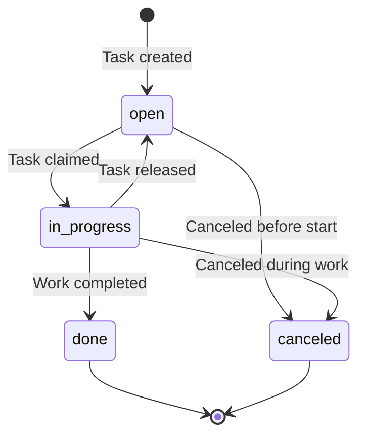

# KitchenTask Table

> **First documented**: 2026-01-30
> **Last updated**: 2026-01-30
> **Last verified by**: spec-executor (T025)
> **Verification status**: ✅ Verified

## Overview

The `KitchenTask` table stores general kitchen operations tasks that are not event-specific prep tasks. These tasks represent day-to-day kitchen work such as cleaning schedules, equipment maintenance, inventory organization, and general prep assignments. Unlike `PrepTask` (which is tied to events/dishes), `KitchenTask` entries are standalone work items managed through the tasks interface.

**Business Context**: Kitchen operations management and staff coordination

**Key Use Cases**:
- Track daily cleaning assignments and maintenance schedules
- Manage general kitchen prep work not tied to specific events
- Support real-time task claiming and progress tracking via Ably
- Enable accountability through task claim history and progress logs

**Lifecycle**: Created → Claimed (optional) → In Progress → Done/Canceled

## Schema Reference

```sql
-- PostgreSQL schema reference
CREATE TABLE tenant_kitchen.kitchen_tasks (
  id UUID PRIMARY KEY DEFAULT gen_random_uuid(),
  tenant_id UUID NOT NULL,

  -- Business columns
  title VARCHAR NOT NULL,
  summary TEXT,
  status VARCHAR NOT NULL DEFAULT 'pending',
  priority SMALLINT NOT NULL DEFAULT 5,
  complexity SMALLINT NOT NULL DEFAULT 5,
  tags TEXT[],
  due_date TIMESTAMPTZ,
  completed_at TIMESTAMPTZ,

  -- Audit
  created_at TIMESTAMPTZ NOT NULL DEFAULT now(),
  updated_at TIMESTAMPTZ NOT NULL DEFAULT now(),
  deleted_at TIMESTAMPTZ,

  -- Foreign Key
  CONSTRAINT fk_kitchen_tasks_tenant FOREIGN KEY (tenant_id)
    REFERENCES platform.accounts(id) ON DELETE RESTRICT
);

-- Indexes
CREATE INDEX idx_kitchen_tasks_tags ON kitchen_tasks USING GIN(tags);
CREATE UNIQUE INDEX kitchen_tasks_tenant_id_idx ON kitchen_tasks(tenant_id, id);

-- Prisma model reference
// File: packages/database/prisma/schema.prisma
// Model: KitchenTask (line ~153)
```

**Click-to-navigate**: Ctrl+click (Cmd+click on Mac) the Prisma schema path above to jump to the model definition.

## Columns

| Column | Type | Nullable | Default | Purpose | Notes |
|--------|------|----------|---------|---------|-------|
| `id` | UUID | No | gen_random_uuid() | Primary key | Auto-generated, composite unique index with tenantId |
| `tenantId` | UUID | No | - | Tenant FK | Required for multi-tenancy, references Account.id |
| `title` | String | No | - | Task title | Brief description of the task |
| `summary` | String | No | "" | Detailed description | Can be empty string, nullable in some contexts |
| `status` | String | No | "pending" | Task status | Should use KitchenTaskStatus enum (open, in_progress, done, canceled) |
| `priority` | Int | No | 5 | Task priority | 1-10 scale (1=urgent, 5=medium, 10=low) stored as SmallInt |
| `complexity` | Int | No | 5 | Task complexity | 1-10 scale (1=simple, 10=complex) stored as SmallInt |
| `tags` | String[] | No | [] | Searchable tags | GIN indexed for efficient tag queries |
| `dueDate` | Timestamptz | Yes | NULL | Due date/time | Optional deadline for task completion |
| `completedAt` | Timestamptz | Yes | NULL | Completion timestamp | Set when status changes to "done" |
| `createdAt` | Timestamptz | No | now() | Creation timestamp | Auto-managed |
| `updatedAt` | Timestamptz | No | now() | Last update | Auto-managed by Prisma @updatedAt |
| `deletedAt` | Timestamptz | Yes | NULL | Soft delete | Filter: `WHERE deleted_at IS NULL` |

### Column Details

#### `title`
- **Type**: String (VARCHAR)
- **Nullable**: No
- **Purpose**: Brief task name/identifier
- **Validation**: Required field, trimmed whitespace
- **Usage**: Displayed in task lists, dashboards

#### `summary`
- **Type**: String (TEXT)
- **Nullable**: No (but can be empty string)
- **Purpose**: Detailed task description
- **Validation**: Optional, defaults to empty string
- **Usage**: Provides context, instructions, or notes

#### `status`
- **Type**: String (VARCHAR)
- **Nullable**: No
- **Default**: "pending"
- **Purpose**: Task workflow state
- **Valid Values** (from `KitchenTaskStatus` enum):
  - `open` - Task available for claiming
  - `in_progress` - Task is being worked on
  - `done` - Task completed
  - `canceled` - Task canceled
- **Gotcha**: Default is "pending" in schema but enum defines "open" - application layer handles transition

#### `priority`
- **Type**: SmallInt (1-10)
- **Nullable**: No
- **Default**: 5
- **Purpose**: Task priority ranking
- **Scale**:
  - 1-2: Urgent/Critical
  - 3-4: High
  - 5-6: Medium (default)
  - 7-8: Low
  - 9-10: Backlog
- **Usage**: Sorting, filtering urgent tasks

#### `complexity`
- **Type**: SmallInt (1-10)
- **Nullable**: No
- **Default**: 5
- **Purpose**: Estimated difficulty/effort
- **Scale**: 1 (simple) to 10 (complex)
- **Usage**: Time estimation, staff assignment

#### `tags`
- **Type**: String[] (TEXT[])
- **Nullable**: No
- **Default**: []
- **Purpose**: Searchable categorization
- **Index**: GIN index for efficient array queries
- **Examples**: `["cleaning", "daily", "cold-station"]`
- **Usage**: Filtering, grouping tasks by category

#### `dueDate`
- **Type**: Timestamptz
- **Nullable**: Yes
- **Purpose**: Task deadline
- **Usage**: Sorting by urgency, overdue detection

#### `completedAt`
- **Type**: Timestamptz
- **Nullable**: Yes
- **Purpose**: When task was marked done
- **Business rule**: Set by application when status changes to "done"

## Relations

### Belongs To

- **References** [`platform.Account`](../../tables/platform/Account.md) via `tenantId`
  - **Required**: Yes
  - **On Delete**: RESTRICT (prevents orphaned tasks)
  - **Composite Key**: `(tenantId, id)` ensures tenant isolation

### Has Many

- **Has many** [`KitchenTaskClaim`](#task-claim-pattern) via `taskId`
  - **Cascade**: Application-managed (claims released when task deleted)
  - **Business rule**: One active claim per task (where `releasedAt IS NULL`)

- **Has many** [`KitchenTaskProgress`](#progress-tracking) via `taskId`
  - **Cascade**: Application-managed (progress history retained on deletion)
  - **Purpose**: Audit trail of status changes, quantity updates, notes

### Click-to-Navigate

All table references above are clickable links. Ctrl+click (Cmd+click on Mac) to jump to related table documentation.

## Business Rules

### Task Claim Pattern

- **Rule**: Only one active claim per task at any time
- **Enforcement**: Application layer (query `WHERE released_at IS NULL` before claiming)
- **Violation**: If violated, multiple employees could claim same task causing confusion

### Status Transitions



**Valid transitions**:
- `open` → `in_progress` (when claimed)
- `in_progress` → `done` (completion)
- `in_progress` → `open` (when released)
- `open/in_progress` → `canceled` (cancellation)
- `done/canceled` → No further transitions (terminal states)

### Priority-Based Routing

- **Urgent tasks** (priority ≤ 2) displayed prominently on dashboards
- **Overdue tasks** (due_date < NOW() AND status NOT IN ('done', 'canceled')) flagged
- **Task assignment**: Higher priority tasks claimable before lower priority

### Data Integrity

- **Uniqueness**: Composite unique key on `(tenantId, id)` prevents cross-tenant ID collisions
- **Required fields**: `tenantId`, `title` cannot be null
- **Referential integrity**: FK to `Account` ensures valid tenant
- **Soft deletes**: Queries must filter `WHERE deleted_at IS NULL`

## Real-Time Update Flow (Ably Integration)

### Outbox Pattern for Task Events

KitchenTask uses the **transactional outbox pattern** to ensure atomicity between database writes and real-time event publication to Ably.

#### Event Types

| Event Type | Trigger | Payload |
|------------|---------|---------|
| `kitchen.task.created` | New task created | taskId, title, priority, status |
| `kitchen.task.updated` | Task fields modified | taskId, title, priority, status |
| `kitchen.task.status_changed` | Status transition | taskId, status, previousStatus |
| `kitchen.task.deleted` | Task deleted | taskId |
| `kitchen.task.claimed` | Task claimed by employee | taskId, employeeId, claimedAt |
| `kitchen.task.released` | Task claim released | taskId, employeeId, reason |
| `kitchen.task.progress` | Progress update logged | taskId, employeeId, progressType, notes |

#### Flow: Task Claim Example

```typescript
// 1. Application layer (apps/app/app/(authenticated)/kitchen/tasks/actions.ts)
await client.$transaction(async (tx) => {
  // Update task status
  await tx.kitchen_tasks.update({
    where: { tenant_id_id: { tenant_id, id: taskId } },
    data: { status: "in_progress" }
  });

  // Create claim record
  const claim = await tx.task_claims.create({
    data: {
      tenant_id,
      task_id: taskId,
      employee_id: employeeId
    }
  });

  // Enqueue outbox event (same transaction)
  await tx.outbox_events.create({
    data: {
      tenant_id,
      aggregateType: "kitchen.task",
      aggregateId: taskId,
      eventType: "kitchen.task.claimed",
      payload: {
        taskId,
        employeeId,
        claimedAt: claim.claimed_at.toISOString()
      },
      status: "pending"
    }
  });
});
// Transaction commits → both DB state and outbox event are atomic

// 2. Background worker (apps/api/app/outbox/publish/route.ts)
// Polls for pending events and publishes to Ably
// Channel: `tenant:${tenantId}`
// Event name: `kitchen.task.claimed`

// 3. Client subscribes (packages/collaboration/hooks.ts)
const channel = ably.channels.get(`tenant:${tenantId}`);
await channel.subscribe("kitchen.task.*", (message) => {
  // Update UI in real-time
});
```

#### Priority Order

Real-time events are prioritized:
1. **Kitchen tasks** (highest) - Task claims, progress updates
2. **Events/Boards** - Battle board updates, event changes
3. **Scheduling** - Staff assignment changes

## Type Fixing

### Type Audit Results

No `any` types found in kitchen task-related code.

**Files reviewed**:
- `apps/app/app/(authenticated)/kitchen/tasks/actions.ts` - All types properly imported from `@repo/database`
- `packages/database/prisma/schema.prisma` - KitchenTask model properly typed
- `packages/database/index.ts` - Exports KitchenTask, KitchenTaskClaim, KitchenTaskProgress, KitchenTaskStatus

**Type safety verified**:
- `KitchenTaskStatus` enum used for status parameter
- `Prisma.InputJsonValue` used for outbox payload
- Proper type imports from `@repo/database`

### Schema Type Consistency

| Column | Prisma Type | PostgreSQL Type | Consistent |
|--------|-------------|-----------------|------------|
| `id` | String @db.Uuid | UUID | ✅ |
| `tenantId` | String @map("tenant_id") @db.Uuid | UUID | ✅ |
| `title` | String | VARCHAR | ✅ |
| `summary` | String | TEXT | ✅ |
| `status` | String | VARCHAR | ✅ (enum enforced at app layer) |
| `priority` | Int @db.SmallInt | SMALLINT | ✅ |
| `complexity` | Int @db.SmallInt | SMALLINT | ✅ |
| `tags` | String[] | TEXT[] | ✅ |
| `dueDate` | DateTime? @db.Timestamptz | TIMESTAMPTZ | ✅ |
| `completedAt` | DateTime? @db.Timestamptz | TIMESTAMPTZ | ✅ |
| `createdAt` | DateTime @db.Timestamptz | TIMESTAMPTZ | ✅ |
| `updatedAt` | DateTime @updatedAt @db.Timestamptz | TIMESTAMPTZ | ✅ |
| `deletedAt` | DateTime? @db.Timestamptz | TIMESTAMPTZ | ✅ |

All types consistent. No issues found.

## Queries

### Fetch All Tasks with Filters

```typescript
// Prisma
await client.kitchen_tasks.findMany({
  where: {
    tenant_id: tenantId,
    deleted_at: null,
    ...(filters?.status && { status: filters.status }),
    ...(filters?.priority && { priority: filters.priority })
  },
  orderBy: { created_at: 'desc' }
});

// SQL
SELECT * FROM tenant_kitchen.kitchen_tasks
WHERE tenant_id = $1 AND deleted_at IS NULL
ORDER BY created_at DESC;
```

**Index used**: Composite unique index on `(tenant_id, id)`

### Fetch Urgent Tasks

```typescript
// Prisma (from actions.ts)
await client.kitchen_tasks.findMany({
  where: {
    priority: { lte: 2 }, // Urgent and Critical
    status: { in: ["open", "in_progress"] }
  },
  orderBy: [{ due_date: "asc" }, { created_at: "asc" }]
});
```

**Index used**: Potential benefit from composite index on `(priority, status, due_date)`

### Fetch Task with Active Claim

```typescript
// Prisma (application join)
const task = await client.kitchen_tasks.findFirst({
  where: { id: taskId }
});

const activeClaim = await client.task_claims.findFirst({
  where: {
    task_id: taskId,
    released_at: null
  }
});
```

**Index used**: `task_claims_task_idx` on `(task_id)`

### Tag-Based Search

```sql
-- Prisma tag query (GIN indexed)
SELECT * FROM tenant_kitchen.kitchen_tasks
WHERE tenant_id = $1
  AND deleted_at IS NULL
  AND tags @> '["cleaning"]';  -- Contains tag
```

**Index used**: `kitchen_tasks_tags_idx` (GIN)

### Gotchas

- **Forgot tenant filter**: Cross-tenant data leakage risk - always include `tenant_id` in WHERE clause
- **Soft delete oversight**: Queries must include `deleted_at IS NULL` or risk returning deleted tasks
- **Claim race condition**: Multiple employees could claim same task if not checked atomically
- **Status enum mismatch**: Schema default "pending" but enum defines "open" - application handles transition

## Task Claim Pattern

### Overview

KitchenTask uses a **claim pattern** where employees can claim tasks to indicate they are working on them. This provides accountability and prevents duplicate work.

### KitchenTaskClaim Table

```prisma
model KitchenTaskClaim {
  tenantId      String    @map("tenant_id") @db.Uuid
  id            String    @default(dbgenerated("gen_random_uuid()")) @db.Uuid
  taskId        String    @map("task_id") @db.Uuid
  employeeId    String    @map("employee_id") @db.Uuid
  claimedAt     DateTime  @default(now()) @map("claimed_at") @db.Timestamptz(6)
  releasedAt    DateTime? @map("released_at") @db.Timestamptz(6)
  releaseReason String?   @map("release_reason")
  createdAt     DateTime  @default(now()) @map("created_at") @db.Timestamptz(6)
  updatedAt     DateTime  @default(now()) @updatedAt @map("updated_at") @db.Timestamptz(6)

  @@id([tenantId, id])
  @@index([taskId])
  @@map("task_claims")
  @@schema("tenant_kitchen")
}
```

### Claim Lifecycle

1. **Claim created**: `claimed_at = now()`, `released_at = NULL`
2. **Claim active**: Task status set to "in_progress"
3. **Claim released**: `released_at = now()`, task status reverts to "open"
4. **Real-time sync**: Claim events published to Ably

### Active Claim Query

```sql
-- Find currently active claim for a task
SELECT *
FROM tenant_kitchen.task_claims
WHERE task_id = $1
  AND released_at IS NULL
LIMIT 1;
```

**Index used**: `task_claims_task_idx` on `(task_id)`

### Claim History

```sql
-- All claims for a task (audit trail)
SELECT *
FROM tenant_kitchen.task_claims
WHERE task_id = $1
ORDER BY claimed_at DESC;
```

**Usage**: Accountability, performance analysis, handoff tracking

## Progress Tracking

### Overview

KitchenTaskProgress maintains an audit trail of all task state changes, quantity updates, and notes. This enables debugging, performance analysis, and communication.

### KitchenTaskProgress Table

```prisma
model KitchenTaskProgress {
  tenantId          String   @map("tenant_id") @db.Uuid
  id                String   @default(dbgenerated("gen_random_uuid()")) @db.Uuid
  taskId            String   @map("task_id") @db.Uuid
  employeeId        String   @map("employee_id") @db.Uuid
  progressType      String   @map("progress_type")
  oldStatus         String?  @map("old_status")
  newStatus         String?  @map("new_status")
  quantityCompleted Decimal? @map("quantity_completed") @db.Decimal(10, 2)
  notes             String?
  createdAt         DateTime @default(now()) @map("created_at") @db.Timestamptz(6)

  @@id([tenantId, id])
  @@index([employeeId])
  @@index([taskId])
  @@index([tenantId, taskId, createdAt(sort: Desc)])
  @@map("task_progress")
  @@schema("tenant_kitchen")
}
```

### Progress Types

| progressType | Usage | Payload Fields |
|--------------|-------|----------------|
| `status_change` | Task status transition | oldStatus, newStatus |
| `quantity_update` | Quantity completed delta | quantityCompleted |
| `note` | General notes/updates | notes |
| `claimed` | Task claimed (redundant with claim) | employeeId, claimedAt |
| `released` | Task released (redundant with claim) | employeeId, reason |

### Progress History Query

```sql
-- Fetch progress log for a task
SELECT *
FROM tenant_kitchen.task_progress
WHERE task_id = $1
ORDER BY created_at DESC;
```

**Index used**: Composite index on `(tenant_id, task_id, created_at DESC)`

### Real-Time Progress Updates

When progress is logged, an outbox event is created:

```typescript
await enqueueOutboxEvent(
  tenantId,
  "kitchen.task.progress",
  taskId,
  "kitchen.task.progress",
  {
    taskId,
    employeeId,
    progressType: "status_change",
    newStatus: "in_progress",
    notes: "Started prep work"
  }
);
```

Published to Ably channel: `tenant:${tenantId}` as event: `kitchen.task.progress`

## TODOs

### High Priority

```markdown
- [ ] [P0] Add composite index on (priority, status, due_date) for urgent task queries
- [ ] [P1] Enforce KitchenTaskStatus enum at database level (CHECK constraint)
- [ ] [P1] Fix status default mismatch - schema "pending" vs enum "open"
```

### Medium Priority

```markdown
- [ ] [P2] Add task recurrence feature (daily, weekly tasks)
- [ ] [P2] Implement task dependencies (task A must complete before task B)
- [ ] [P2] Add estimated_time_minutes column for time tracking
```

### Low Priority

```markdown
- [ ] [P3] Add task templates for common tasks
- [ ] [P3] Implement task assignment (pre-assign vs claim-based)
- [ ] [P3] Add task categories (separate from tags for hierarchical grouping)
```

## Related Tables

- [`KitchenTaskClaim`](../tenant_kitchen/KitchenTaskClaim.md) - Task claim records (one active claim per task)
- [`KitchenTaskProgress`](../tenant_kitchen/KitchenTaskProgress.md) - Progress tracking history
- [`OutboxEvent`](../tenant/OutboxEvent.md) - Real-time event publishing via outbox pattern
- [`platform.Account`](../platform/Account.md) - Tenant reference (multi-tenancy)

## Related Code

- **Prisma Model**: [`packages/database/prisma/schema.prisma`](../../../packages/database/prisma/schema.prisma#L153)
- **Business Logic**: `apps/app/app/(authenticated)/kitchen/tasks/actions.ts`
- **Real-time Hooks**: `packages/collaboration/hooks.ts`
- **Outbox Worker**: `apps/api/app/outbox/publish/route.ts`
- **Tests**: `apps/app/__tests__/kitchen/tasks.test.ts` (if exists)

## See Also

- **Schema Documentation**: [`../../schemas/07-tenant_kitchen.md`](../../schemas/07-tenant_kitchen.md)
- **Schema Overview**: [`../../SCHEMAS.md`](../../SCHEMAS.md)
- **Known Issues**: [`../../KNOWN_ISSUES.md`](../../KNOWN_ISSUES.md)
- **Migration History**: [`../migrations/README.md`](../migrations/README.md)
